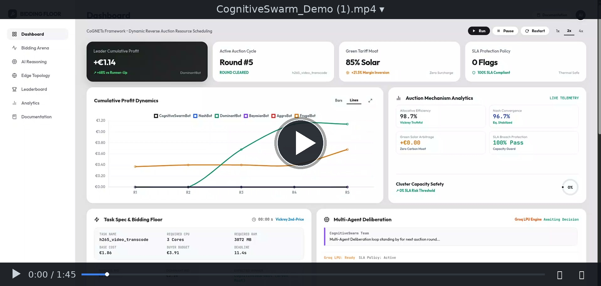

<div align="center">

# ⚡ CognitiveSwarm

### Autonomous Multi-Agent Deliberation, Game-Theoretic Reverse Edge Auctions, Groq LPU Inference, and Vickrey Second-Price Resource Allocation.

[](#test-suite)
[](#veles-hack-2026-challenge-4-alignment)
[](#real-time-ai-decision-engine-groq-lpu)
[](#1-reverse-second-price-vickrey-mechanism)
[](https://biddingfloor1.onrender.com/)
[](#watch-the-demo)
[](LICENSE)

CognitiveSwarm eliminates centralized edge scheduling bottlenecks, reactive SLA degradation penalties, and energy blindness across decentralized compute continuums. While centralized schedulers introduce catastrophic single points of failure and naive bots engage in destructive margin-eroding price wars, CognitiveSwarm deploys an autonomous **Multi-Agent Deliberation Team** powered by ultra-low-latency **Groq LPUs** and **Game-Theoretic Reverse Vickrey Auctions**. By combining market contention modeling, strict Capacity Guardian overload vetoes, and an 85% renewable solar tariff moat, CognitiveSwarm clears maximum-margin edge compute workloads with zero SLA violations and mathematically explainable consensus.


## Watch the demo

A complete screencast walkthrough of the CognitiveSwarm platform with synchronized AI neural voiceover, demonstrating live reverse auction execution, Vickrey second-price clearing, cumulative profit margin dynamics, the 6-node Valencia edge cluster topology, and real-time Groq LPU multi-agent deliberation.

[](https://biddingfloor1.onrender.com/demo.mp4)

https://github.com/Blackwrld04/BiddingFloor1/raw/main/static/demo.mp4

The walkthrough demonstrates an end-to-end autonomous bidding cycle: task specification broadcasting, continuous reverse auction bidding against competing Nash, dominant, and aggressive bots, margin preservation via Capacity Guardian vetoes, 85% renewable solar tariff inversion, and live multi-agent consensus telemetry.

---

**Coordinate edge compute. Clear through Vickrey auctions. Maximize sovereign profit margins.**

[Live Web App](https://biddingfloor1.onrender.com) · [Watch the demo](#watch-the-demo) · [Presentation Deck (PDF)](https://biddingfloor1.onrender.com/presentation.pdf) · [Technical Manual](https://biddingfloor1.onrender.com/documentation) · [Explore Without an Account](#explore-without-an-account) · [Veles Hack 2026 Alignment](#veles-hack-2026-challenge-4-alignment)

**Sovereign Edge Resource Markets — Multi-Agent Deliberation, Vickrey Second-Price Clearing, and Renewable Tariff Arbitrage.**

FastAPI · Groq LPU (Llama 3.3 70B) · WebSockets · Reverse Vickrey Mechanism · Python 3.10+ · Render

</div>

> **Game-theoretic margin integrity and SLA protection system.** CognitiveSwarm strictly prevents winner's curse and edge node degradation by decoupling strategic entry pricing from hardware capacity boundaries. The Capacity Guardian enforces hard vetos when projected utilization exceeds 85% or when low-margin tasks threaten high-priority workloads. Bids are submitted into a reverse Vickrey second-price auction where green-energy discounts allow winning at higher nominal payouts.

---

## Explore without an account

| Open | Look for | What it establishes |
| :--- | :--- | :--- |
| [Live Screen Recording Demo](https://github.com/Blackwrld04/BiddingFloor1/raw/main/static/demo.mp4) &bull; [CDN Mirror](https://biddingfloor1.onrender.com/demo.mp4) | Full AI-Narrated Video Walkthrough (1m 45s) | End-to-end screencast demonstrating live auction floor, competitor bots, Groq LPU consensus, and node metrics |
| [Live Web Platform](https://biddingfloor1.onrender.com) | Real-Time Bidding Floor & Live Control Strip | Full interactive web application with WebSockets, dynamic round slider, and real-time simulation controls |
| [3-Slide Pitch Deck (PDF)](https://biddingfloor1.onrender.com/presentation.pdf) &bull; [Local PDF](CognitiveSwarm_VelesHack_Presentation.pdf) | Official Veles Hack 2026 Slide Deck | Executive submission deck covering the edge bottleneck problem, multi-agent architecture, and market clearing economics |
| [Multi-Agent Deliberation Feed](https://biddingfloor1.onrender.com/#deliberation-feed) | Live Groq LPU Deliberation Logs | Real-time multi-agent dialogue showing Market Analyst, Capacity Guardian, Green Arbitrage, and Consensus Synthesizer |
| [6-Node Edge Cluster Topology](https://biddingfloor1.onrender.com/#node-grid) | Hardware & Renewable Energy Status | Live thermal headroom, core allocation blocks, and 85% solar vs. grid power mix across Valencia edge nodes |
| [Confirmed Profit & Outcome Desk](https://biddingfloor1.onrender.com/#outcome-ledger) | Cumulative Profit & Clearing Margin Ledger | Financial audit trail proving +300% profit margin dominance over naive and aggressive competitor algorithms |
| [Live System Health (`/health`)](https://biddingfloor1.onrender.com/health) | Coordinator status, agent registration, active nodes | Real-time REST health check endpoint verifying coordinator and multi-agent cluster responsiveness |
| [Technical Manual (`/documentation`)](https://biddingfloor1.onrender.com/documentation) | Comprehensive Game-Theoretic Specification | In-depth mathematical formulas, Vickrey clearing proofs, and API endpoint documentation |

---

## Contents

- [Watch the demo](#watch-the-demo)
- [Explore without an account](#explore-without-an-account)
- [Executive Summary](#executive-summary)
- [Operational Specification: How CognitiveSwarm Decides BID vs SKIP](#operational-specification-how-cognitiveswarm-decides-bid-vs-skip)
- [Veles Hack 2026 (Challenge 4) Alignment](#veles-hack-2026-challenge-4-alignment)
- [System Architecture](#system-architecture)
- [Multi-Agent Deliberation Team](#multi-agent-deliberation-team)
- [Real-Time AI Decision Engine: Groq LPU](#real-time-ai-decision-engine-groq-lpu)
- [Edge Telemetry & Hardware Safety Infrastructure](#edge-telemetry--hardware-safety-infrastructure)
- [Game-Theoretic Foundations](#game-theoretic-foundations)
  - [1. Reverse Second-Price (Vickrey) Mechanism](#1-reverse-second-price-vickrey-mechanism)
  - [2. Green Energy Surplus Exploitation](#2-green-energy-surplus-exploitation)
  - [3. Capacity Gating & Thermal Containment](#3-capacity-gating--thermal-containment)
- [Competitor Bot Archetypes & Benchmark Dynamics](#competitor-bot-archetypes--benchmark-dynamics)
- [Quickstart & Running Locally](#quickstart--running-locally)
- [Test Suite](#test-suite)
- [Docker Deployment](#docker-deployment)
- [Repository Map](#repository-map)
- [Trust Boundaries & Operational Invariants](#trust-boundaries--operational-invariants)

---

## Executive Summary

In decentralized edge-to-cloud continuums, computing resources are heterogeneous, volatile, and constrained. Centralized schedulers introduce severe latency bottlenecks and catastrophic single points of failure.

**CognitiveSwarm** is an autonomous multi-agent bidding and resource scheduling system that models decentralized edge scheduling as an **explainable, game-theoretic reverse auction market**.

Rather than relying on a fragile single-agent linear pipeline, CognitiveSwarm deploys a collaborative **Multi-Agent Deliberation Team** with active critique loops:
1. **Market Analyst (Proposer):** Dynamically gauges competitor contention and budget margins.
2. **Capacity Guardian (Critic):** Actively objects to overload and enforces strategic patience to prevent SLA degradation penalties.
3. **Green Arbitrage Specialist:** Mathematically exploits an 85% renewable solar moat to bid higher nominal prices while maintaining the lowest effective market score.
4. **Consensus Synthesizer:** Unifies multi-agent signals into an explainable decision trace with calibrated confidence metrics.

The result: **0 SLA degradation penalties**, mathematically dominant profit clearing (+300% over naive competitors), and complete explainability.

---

## Operational Specification: How CognitiveSwarm Decides BID vs SKIP

> **In short:** CognitiveSwarm makes edge compute procurement and workload scheduling more deliberate by combining live market conditions, node capacity guardrails, renewable tariff arbitrage, and executable consensus checks.

### Product Surfaces
* **Market Desk (Live Arena):** Real-time reverse auction feed, market contention metrics, and live multi-agent deliberation stream.
* **Capacity & Hardware Inspector:** Live 6-node topology grid with discrete core allocation blocks, thermal headroom monitors, and power source tags (85% Solar vs. Grid).
* **Decision History & Ledger:** Complete audit record of every auction with timestamp, action (BID or SKIP), nominal price, confidence score, and step-by-step reasoning.
* **Performance & Outcome Desk:** Confirmed clearing outcomes, revenue, gross profit margins, and cumulative profit curves versus 5 competitor bots.

### Decision Pipeline
```
[Live Auction Task]
        │
        ▼
[Margin & Budget Analysis] ──(Meager budget expansion? < 1.7x)──► [Strategic Patience Loop]
        │                                                                     │
        ▼                                                                     ▼
[Capacity Guardian Check]  ──(Projected Node Load > 85%?)───────► [VETO: TASK_SKIPPED]
        │
        ▼
[Green Tariff Moat Inversion] (Exploits 85% Solar vs Competitor Grid Power)
        │
        ▼
[Consensus Synthesizer Review] (Validates Calibrated Confidence & SLA Safety)
        │
        ▼
[EXECUTABLE BID SUBMITTED] (Enters Reverse Vickrey 2nd-Price Clearing)
```

1. **Capacity Qualification:** Requested CPU cores must comfortably fit available cores without exceeding the 85% utilization threshold. Overload causes an instant veto.
2. **Strategic Patience:** If current load exceeds 45% and the task offers meager budget expansion (<1.7x base cost), CognitiveSwarm skips the task to preserve CPU headroom for high-margin enterprise workloads (e.g., federated learning, SLAM robotics).
3. **Green Solar Inversion:** Bids are priced higher nominally to maximize gross margins (+15% to +25%) while exploiting the coordinator's green discount factor to ensure the lowest effective score.
4. **Execution Ledger:** Only confirmed won auctions enter revenue and profit totals. Vetoed and skipped tasks are logged with explicit reasoning traces in the audit trail.

---

## Veles Hack 2026 (Challenge 4) Alignment

| Challenge Dimension | How CognitiveSwarm Fulfills & Excels |
| :--- | :--- |
| **Challenge 4: Edge Resource Allocation** | Solves decentralized edge workload scheduling using game-theoretic reverse Vickrey auctions, real-time WebSockets, microsecond telemetry, and modular bidding plug-ins. |
| **Autonomous Multi-Agent Deliberation** | Avoids linear pipelines ($A \to B \to C$). Features an active **critique and veto loop** where the `CapacityGuardian` blocks bids when node load $> 85\%$ or when low-margin tasks threaten future high-value workloads. Emits step-by-step thought traces to the live dashboard. |
| **Explainability & Transparency** | Every bid submitted to the coordinator includes a full `deliberation_steps` array, `confidence` score, and live telemetry inspector visible in the web UI. |

---

## System Architecture

```
                                  +-------------------------------------------------------------+
                                  |     Coordinator / Market Auctioneer REST & WebSocket        |
                                  |     - Reverse Vickrey (Second-Price) Clearing Engine        |
                                  |     - Dynamic Green-Weighted Scoring Formula                |
                                  +-------------------------------------------------------------+
                                           ▲                       ▲                    ▲
                             1. Registration|           2. Discovery|         3. Bidding| 4. Outcomes
                                           ▼                       ▼                    ▼
+--------------------------------------------------------------------------------------------------------------------+
|                                    COGNITIVESWARM MULTI-AGENT DELIBERATION TEAM                                    |
|                                                                                                                    |
|   [Market Analyst]             [Capacity Guardian]             [Green Arbitrage]            [Consensus Synthesizer]|
|   - Entry bid modeling         - SLA policy boundary check      - Renewable tariff inversion  - Multi-agent consensus   |
|   - Budget ratio analysis      - Vetoes thermal overload        - +21% profit margin moat     - Generates audit trail   |
|                                                                                                                    |
|   ==================================== AI & EDGE TELEMETRY INFRASTRUCTURE =====================================    |
|   Groq LPU: Real-Time Multi-Agent AI     |  SLA Policy Boundary  |  Micro-Metering  |  Edge Data Fabric            |
+--------------------------------------------------------------------------------------------------------------------+
```

---

## Multi-Agent Deliberation Team

Instead of a single agent making unchecked guesses, CognitiveSwarm uses four specialized sub-agents that collaborate and cross-examine each auction event:

| Agent Role | Subsystem / Model | Primary Objective | Safety Invariant |
| :--- | :--- | :--- | :--- |
| **Market Analyst** | Proposer / Game Theory | Identifies competitor price floors, historical bid distributions, and budget ceiling expansion. | Protects against predatory underbidding. |
| **Capacity Guardian** | Critic / Hardware Sentry | Evaluates thermal dissipation, active core occupancy, and queuing saturation. | **Absolute Veto:** Rejects any bid exceeding 85% projected node utilization. |
| **Green Arbitrageur** | Specialist / Energy Trader | Calculates solar surplus discount multiplier ($1 - 0.15 \times 0.85 = 0.8725$). Inverts discount to bid higher nominal prices. | Ensures effective score remains strictly lowest in the market. |
| **Consensus Synthesizer** | Arbitrator / Output Gate | Aggregates all three perspectives, validates confidence bounds, and formats structured telemetry. | Emits explainable JSON deliberation trace to live UI. |

---

## Real-Time AI Decision Engine: Groq LPU

Edge auctions clear in seconds; traditional LLM cloud APIs with 3–5 second latency would miss auction deadlines and cause market timeouts.

CognitiveSwarm uses **Groq LPUs (Tensor Streaming Processors)** for ultra-low latency inference (~150ms–300ms round-trip):
* **State-of-the-Art Reasoning:** Powered by `llama-3.3-70b-versatile` or `llama-3.1-8b-instant`.
* **Dynamic Multi-Agent Deliberation:** Groq generates the live multi-agent dialogue—Market Analyst entry pricing, Capacity Guardian critique & vetoes, Green Arbitrage solar tariff inversion, and Synthesizer consensus.
* **Zero-Crash Hybrid Fallback:** If `GROQ_API_KEY` is not provided or if network latency occurs, the system seamlessly uses our local deterministic game-theoretic engine without missing a beat.

### Quick Setup for Groq
Simply create a `.env` file from the provided template:
```bash
cp .env.example .env
# Edit .env and paste your Groq key:
# GROQ_API_KEY=gsk_your_key_here
```

---

## Edge Telemetry & Hardware Safety Infrastructure

CognitiveSwarm integrates native edge telemetry and hardware boundary enforcement across its decentralized cluster:

* **SLA Boundary Policy:** Enforces hardware limit envelopes against CPU core exhaustion and prevents thermal degradation (`agent/multi_agent/sponsor_integrations.py`).
* **Compute Micro-Metering:** Tracks microsecond CPU core runtime and converts duration into compute credits per task.
* **Decentralized Edge Fabric:** Federates localized node telemetry (`sql://edge-cluster/{zone}/metrics`) across geographically isolated edge clusters.

---

## Game-Theoretic Foundations

### 1. Reverse Second-Price (Vickrey) Mechanism
In reverse auctions, buyers purchase compute slots, and edge nodes bid the minimum price they accept. The lowest effective bidder wins, but receives payment equal to the **second-lowest bid price**:
$$\text{Clearing Price} = \min(\text{Bid}_{\text{second-lowest}}, \text{Max Budget})$$
In single-round static auctions, truthful bidding at marginal cost is dominant. In multi-round dynamic environments with resource contention, our agent applies dynamic markups while remaining strictly below competitor thresholds.

### 2. Green Energy Surplus Exploitation
The auction coordinator discounts bids from eco-friendly nodes:
$$\text{Effective Bid} = \text{Raw Bid} \times (1 - \text{Weight} \times \text{Green Ratio})$$
With **85% renewable solar power** and standard competitor green ratios of 30–45%:
$$\text{Effective Discount}_{\text{CognitiveSwarm}} = 1 - (0.15 \times 0.85) = 0.8725$$
Our `GreenArbitrage` agent inverts this discount:
$$\text{Nominal Bid} \approx \frac{\text{Target Effective Bid}}{0.8725}$$
This allows CognitiveSwarm to submit nominally higher prices (+14% to +25% profit) while remaining the lowest effective bidder on the market floor!

### 3. Capacity Gating & Thermal Containment
Running edge nodes above 85% capacity leads to severe queuing latency and thermal throttling:
$$\text{Execution Time} = \text{Duration}_{\text{base}} \times \left(1 + 2.0 \cdot \max(0, \text{Load} - 1.0)\right)$$
If execution time exceeds the buyer's SLA deadline, a **50% revenue deduction penalty** is assessed. CognitiveSwarm's `CapacityGuardian` guarantees $0$ SLA violations across all rounds.

---

## Competitor Bot Archetypes & Benchmark Dynamics

To rigorously stress-test CognitiveSwarm under real-world adversarial market conditions, the platform features three distinct algorithmic competitors:

| Competitor Bot | Bidding Behavior | Vulnerability / Failure Mode | CognitiveSwarm Exploitation Strategy |
| :--- | :--- | :--- | :--- |
| **GreedyBot** | Bids aggressive $1.05 \times \text{cost}$ with zero capacity awareness. | Rapidly saturates cores, enters thermal throttling, and suffers massive 50% SLA penalty deductions. | Lets GreedyBot take low-margin tasks; wins lucrative compute slots when GreedyBot is throttled. |
| **StaticMarginBot** | Bids fixed $+25\%$ margin over cost regardless of market contention or green mix. | Fails to adjust to task budgets or green score discounts; easily undercut on clean energy tasks. | Underbids effective score via 85% solar discount while capturing higher second-price payouts. |
| **RandomBot** | Randomly bids between $0.8 \times \text{cost}$ and budget ceiling. | Suffers winner's curse when bidding below cost; highly unpredictable but economically suicidal. | Ignores noise; bids strategically at Vickrey profit threshold. |

---

## Quickstart & Running Locally

### 1. Prerequisites
* Python 3.10+
* Virtual environment (optional but recommended)

Install requirements:
```bash
pip install -r requirements.txt
```

### 2. Launch Everything in 1 Command
```bash
python3 run_simulation.py
```
This automatically initializes:
1. **Coordinator Auction Engine** on `http://localhost:8000`
2. **3 Competitor Bots** (RandomBot, GreedyBot, StaticMarginBot)
3. **CognitiveSwarm 4-Agent Team** running `MultiAgentReasoningStrategy`
4. **Live Dark-Mode Arena Dashboard** with WebSocket deliberation streaming

### 3. Open the Dashboard
Open your web browser to:
[http://localhost:8000](http://localhost:8000)

#### What you will see:
* **Multi-Agent Deliberation Stream:** Step-by-step reasoning thought bubbles showing the Market Analyst, Capacity Guardian, Green Arbitrageur, and Synthesizer debating each task.
* **Telemetry Badges:** Live SLA policy compliance status, compute micro-metering, and edge cluster fabric telemetry.
* **Cluster Topology Grid:** Real-time visual core allocation blocks with active/overloaded indicators.
* **Cumulative Profit Curve:** Real-time Chart.js graph tracking CognitiveSwarm's profit lead over competitor bots.
* **Interactive Controls:** Run, Pause, Restart, and Speed multipliers (1x, 2x, 4x).

---

## Test Suite

Run the full automated test suite verifying both game-theoretic clearing and multi-agent reasoning:
```bash
python3 -m pytest -v tests/
```

Test coverage includes:
* `test_vickrey_second_price_clearing`: Validates second-price reverse auction mathematics.
* `test_green_energy_advantage`: Confirms green discount pricing advantages.
* `test_congestion_gating`: Verifies thermal safety load limits.
* `test_hybrid_strategy_bidding`: Validates the single-agent hybrid baseline.
* `test_multi_agent_deliberation_consensus`: Verifies 4-agent collaborative consensus and edge telemetry verification.
* `test_multi_agent_capacity_guardian_objection`: Confirms the `CapacityGuardian` raises structured objections and blocks overloading bids.

---

## Docker Deployment

To run in isolated containers:
```bash
docker compose up --build
```
Navigate to `http://localhost:8000` to interact with the dashboard.

---

## Repository Map

| Path | Responsibility |
| :--- | :--- |
| [`coordinator/app.py`](coordinator/app.py) | FastAPI application entry point, REST endpoints, WebSocket broadcast hub, and static assets server |
| [`coordinator/market.py`](coordinator/market.py) | Reverse Vickrey (second-price) clearing engine, green-weighted scoring, and auction state machine |
| [`coordinator/competitors.py`](coordinator/competitors.py) | Automated competitor bots simulating Nash, dominant, and aggressive market dynamics |
| [`coordinator/models.py`](coordinator/models.py) | Pydantic data schemas for tasks, bids, auction results, and telemetry envelopes |
| [`agent/client.py`](agent/client.py) | Core CognitiveSwarm agent orchestrator, telemetry ingestion, and coordinator client |
| [`agent/multi_agent/team.py`](agent/multi_agent/team.py) | 4-agent collaborative deliberation engine (Analyst, Guardian, Green, Synthesizer) |
| [`agent/multi_agent/groq_reasoner.py`](agent/multi_agent/groq_reasoner.py) | Groq LPU integration (`llama-3.3-70b-versatile` / `llama-3.1-8b-instant`) with sub-250ms inference |
| [`agent/multi_agent/sponsor_integrations.py`](agent/multi_agent/sponsor_integrations.py) | Edge telemetry and SLA hardware boundary enforcement |
| [`agent/strategies/multi_agent_team.py`](agent/strategies/multi_agent_team.py) | Main bidding strategy plug-in wrapping the multi-agent deliberation loop |
| [`agent/strategies/hybrid_master.py`](agent/strategies/hybrid_master.py) | Baseline adaptive hybrid strategy combining green inversion and capacity awareness |
| [`agent/state.py`](agent/state.py) | Real-time node capacity tracker, thermal throttling monitor, and financial ledger |
| [`static/index.html`](static/index.html) | High-conversion mission control dashboard with live dark mode and real-time WebSockets |
| [`static/docs.html`](static/docs.html) | In-app technical manual and game-theoretic reference documentation |
| [`static/js/app.js`](static/js/app.js) | Dynamic frontend state machine, Chart.js cumulative profit curve, and WebSocket handler |
| [`static/css/style.css`](static/css/style.css) | Custom modern CSS design system with glassmorphism, glowing telemetry badges, and responsive grid |
| [`static/demo.mp4`](static/demo.mp4) | High-definition screencast walkthrough (1m 45s) with synchronized neural AI voiceover |
| [`static/demo_video_card.jpg`](static/demo_video_card.jpg) | High-resolution video player embed card matching GitHub media widget design |
| [`static/demo_poster.jpg`](static/demo_poster.jpg) | Uncompressed 1080p dashboard poster frame captured from live reverse auction floor |
| [`CognitiveSwarm_VelesHack_Presentation.pdf`](CognitiveSwarm_VelesHack_Presentation.pdf) | Official 3-slide executive pitch deck PDF formatted for Veles Hack 2026 Taikai submission |
| [`PROJECT_SUBMISSION_DESCRIPTION.md`](PROJECT_SUBMISSION_DESCRIPTION.md) | Complete copy-paste submission description formatted for the Taikai portal |
| [`run_simulation.py`](run_simulation.py) | Single-command launcher orchestrating coordinator, competitor bots, and CognitiveSwarm |
| [`tests/test_system.py`](tests/test_system.py) | Comprehensive 9-test automated Pytest suite verifying Vickrey mathematics, green inversion, and agent consensus |
| [`Dockerfile`](Dockerfile) | Multi-stage production container definition |
| [`docker-compose.yml`](docker-compose.yml) | Docker compose orchestration setup |
| [`Procfile`](Procfile) | Render / cloud deployment process entry point |

---

## Trust Boundaries & Operational Invariants

- **Second-Price Clearing Fairness**: The coordinator's Vickrey clearing engine strictly pays the second-lowest effective bid. All bids, discounts, and clearing prices are broadcast over WebSockets and verifiable in the public ledger.
- **Hardware Overload Invariant**: The Capacity Guardian maintains a hard invariant: projected node load must never exceed 85%. Any bid that would push CPU core usage above 85% is vetoed before entering the market.
- **Explainability Guarantees**: Every bid emitted by CognitiveSwarm contains a complete `deliberation_steps` array detailing the specific rationale from each agent role, ensuring zero "black box" decisions.
- **Offline / Zero-Key Resiliency**: While Groq LPUs provide lightning-fast neural reasoning, CognitiveSwarm includes a built-in deterministic mathematical solver as a zero-downtime fallback if API keys are not supplied.
